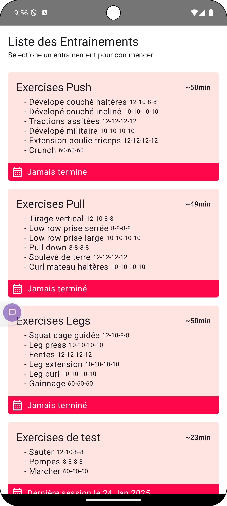
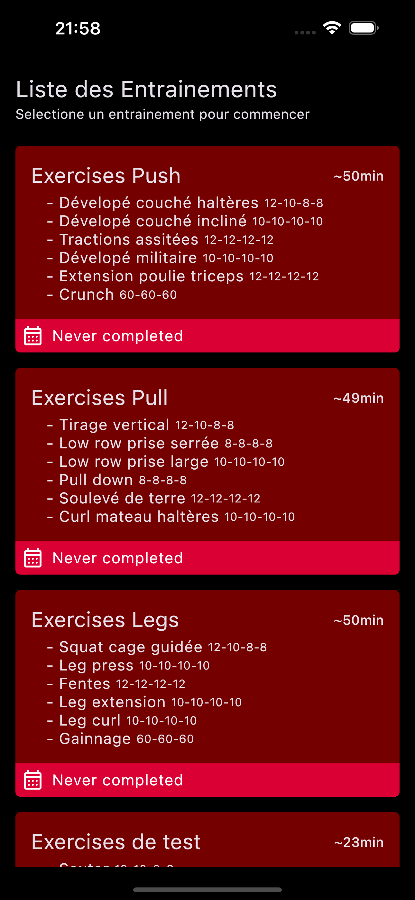
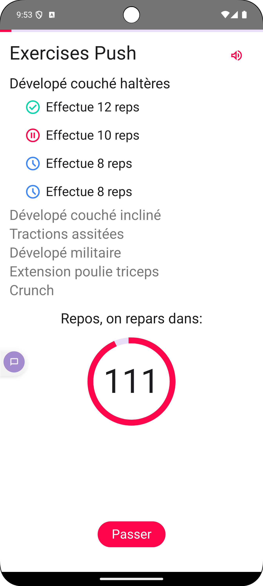
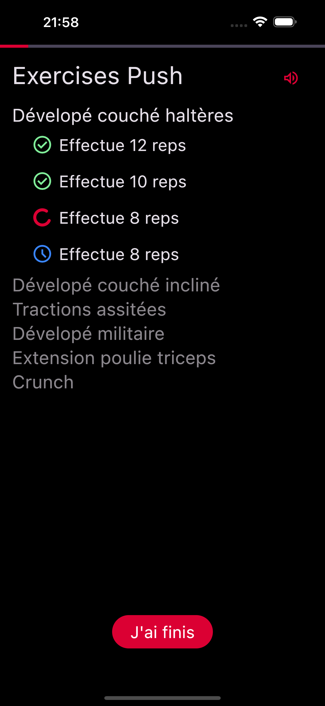

# MyTrainer App
|                             android                             |                             ios                             |
|:---------------------------------------------------------------:|:-----------------------------------------------------------:|
|  |  |
|  |  |

A simple app to track a PPL gym program
Features:
- List of trainings with details (exercises, series, estimated duration and last session date).
- Start a training, it will run through all the exercices and series in order, with a recovery countdown, skippable.
- (Partly) localized
- Light / Dark mode
- TextToSpeech to announce 30s left and 5/4/3/2/1 before next series

Tools:
- Koin for dependency injection
- Room for storage
- Material3
- kotlinx-datetime